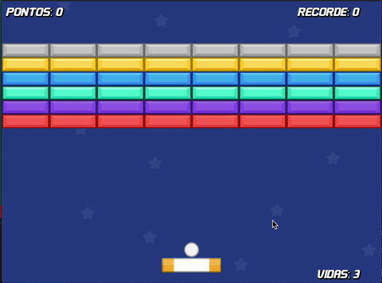

# 🎮 Super Arkanoid

Um jogo clássico de quebra-blocos desenvolvido em Godot 4.4, inspirado no famoso Arkanoid. Quebre todos os blocos usando a bola que rebate na sua raquete e avance pelos níveis!

## 📸 Demonstração


## 🚀 Características

- **3 níveis únicos** com layouts diferentes de blocos
- **Sistema de vidas** (3 vidas iniciais)
- **Sistema de pontuação** com record
- **Power-ups especiais** que permitem atirar projéteis
- **Diferentes tipos de blocos** com resistências variadas
- **Efeitos sonoros** imersivos
- **Interface intuitiva** com HUD informativo
- **Shader customizado** para efeitos visuais de fundo

## 🎯 Como Jogar

### Controles
- **A** ou **Seta Esquerda**: Mover raquete para a esquerda
- **D** ou **Seta Direita**: Mover raquete para a direita  
- **Espaço**: Iniciar o jogo/Lançar a bola
- **N**: Pular para o próximo nível (teste)

### Objetivo
1. Use a raquete para rebater a bola
2. Quebre todos os blocos para avançar de nível
3. Colete power-ups para ativar tiros especiais
4. Complete os 3 níveis para vencer o jogo
5. Tente bater seu próprio record de pontuação!

### Sistema de Pontuação
- **5 pontos** por bloco destruído
- Blocos diferentes podem ter resistências variadas
- Record é salvo automaticamente

## 🛠️ Tecnologias

- **Engine**: Godot 4.4
- **Linguagem**: GDScript
- **Plataforma**: Desenvolvido para Mobile (mas funciona em desktop)
- **Resolução**: 640x480

## 📁 Estrutura do Projeto

```
super-arkanoid/
├── Scenes/           # Cenas do jogo (.tscn)
│   ├── ball.tscn
│   ├── player.tscn
│   ├── block.tscn
│   ├── level_*.tscn
│   └── ...
├── Scripts/          # Scripts GDScript (.gd)
│   ├── game_manager.gd
│   ├── player.gd
│   ├── ball.gd
│   └── ...
├── Sprites/          # Texturas e imagens
├── Sounds/           # Efeitos sonoros e música
├── Fonts/            # Fontes personalizadas
└── Shaders/          # Shaders customizados
```

## 🎨 Assets

O jogo inclui:
- **Sprites coloridos** para blocos (azul, verde, vermelho, amarelo, roxo, cinza)
- **Efeitos sonoros** para colisões, tiros e música de fundo
- **Fonte customizada** Flatwheat-Regular
- **Shader de fundo** para efeitos visuais

## 🚀 Como Executar

1. Instale o [Godot 4.4](https://godotengine.org/download)
2. Clone ou baixe este repositório
3. Abra o projeto no Godot (arquivo `project.godot`)
4. Pressione F5 ou clique em "Play" para executar
5. Divirta-se jogando!

## 🎮 Recursos Especiais

### Power-ups
- Colete estrelas que caem dos blocos destruídos
- Ative o modo de tiro duplo temporariamente
- Use os projéteis para destruir blocos mais rapidamente

### Sistema de Níveis
- **Nível 1**: Introdução ao jogo
- **Nível 2**: Aumento da dificuldade
- **Nível 3**: Desafio final

### GameManager
O jogo utiliza um sistema de gerenciamento global que controla:
- Pontuação e record
- Sistema de vidas
- Progressão entre níveis
- Ativação de power-ups

## 🏆 Vitória

Complete todos os 3 níveis para ser direcionado à tela de vitória e ver sua pontuação final!

## 📝 Licença

Este projeto foi desenvolvido como um projeto educacional/hobby. Sinta-se livre para estudar, modificar e aprender com o código!

---

*Desenvolvido com ❤️ usando Godot Engine*